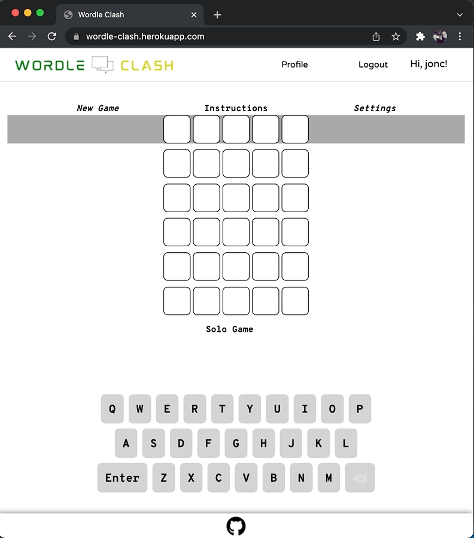
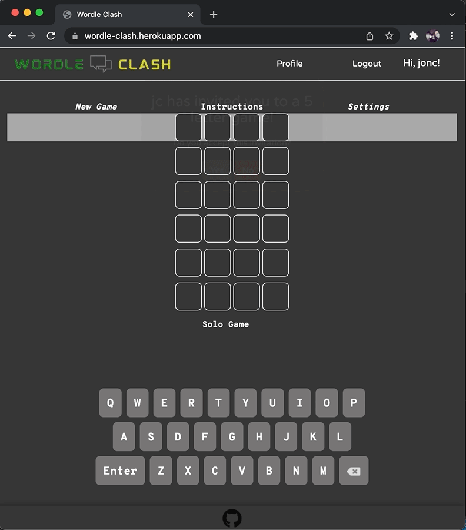
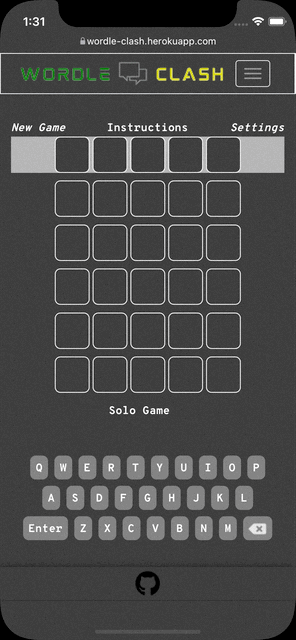
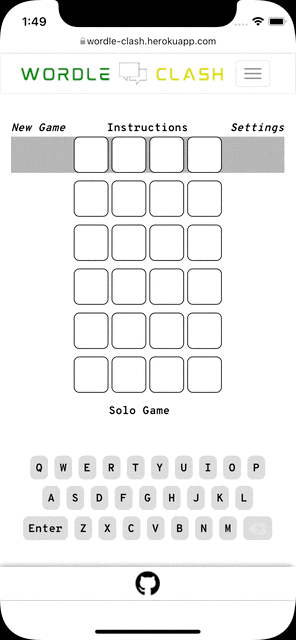

# Wordle Clash

## **Purpose of the app:**

Gives the popular single-player game [Wordle](https://www.nytimes.com/games/wordle/index.html) a competitive twist.

## **How to use:**

All the game action takes place from the home page. Users may type letters using a physical keyboard while the game screen is selected (pressing the Enter key submits the guess), or by utilizing the custom keyboard along the bottom of the window. After the guess is submitted, the game will color code each letter in the guess:

1. Letter is not in the word - Black
2. Letter is in the word but the wrong location - Yellow
3. Letter is in the word at the correct location - Green

The keyboard along the bottom of the screen will also indicate which letters have been used and the appropriate status.

Users without an account can experience the solo, single-player version. To enable match-play (up to 2 players at this time), and to save game stats, the user must log in or create an account.

## Features of the app:

This app utilizes Socket.IO for the majority of the game logic. The secret word is stored in server memory on each game session and not accessible to the user until the word is guessed or 6 guesses have been submitted. When a user submits a guess, the server processes the guess and sends in real-time to all users in the session whether each letter is in-place, out-of-place, or not in the secret word (without information on the letters submitted).

On match-play, the server waits until both players have completed (by either correctly guessing the word or guessing incorrectly 6 times) to determine the winner of the match, the priorities to determine the winner of a match are as follows:

**Both players guess the word correctly**

1. The player with the least amount of guess to the correct word.
2. The player that guesses the correct word earlier.

**One player guesses the word**

3. The player the guesses the word.

**Neither player guesses the word**

4. The player with the most letters in the correct spot on the final guess.
5. The player with the most letters from the secret word on the final guess.
6. The player that completes the guesses earlier.

**Note:** _Completion time is only used when all other stats are equal._

## Live link:

https://wordle-clash.herokuapp.com/

## User Guess and Invitation To Match (Browser light mode and dark mode):

## User Guess and Invitation To Match (Mobile light mode and dark mode):

## Featured programs:

HTML, CSS, Bootstrap, JavaScript, Node.js, Socket.IO, Handlebars

## Database:

PostgreSQL using Sequelize ORM

## External Resources:

Word list from [Word Game Dictionary](https://www.wordgamedictionary.com/word-lists/)

## This site was built by

[Katie Freeman](https://github.com/katie-freeman), [Jon Cundiff](https://github.com/jon-cundiff), [Serghei Tolstov](https://github.com/T0lst0v)
